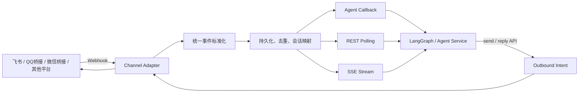

# OpenClaw Channel Gateway Standalone

一个可独立运行的消息通道网关，将聊天平台事件转换为统一消息协议，并通过 REST、SSE 或 Agent 回调交给 LangGraph、LangChain、自研 Agent 服务或普通业务服务处理。

> **项目性质**
>
> 本项目依据 OpenClaw 官方仓库中 Channel/Gateway 的职责边界和公开接口行为进行独立化抽取与重新实现，参考基线为 `openclaw/openclaw v2026.7.1-2`。它不是 OpenClaw 官方发行物，也不是 OpenClaw Plugin SDK 的二进制或源码级直接替代品。压缩包中未打包 OpenClaw 的 Agent、模型、工具、记忆、节点、控制台或完整插件运行时。

## 1. 保留的能力

- 多通道、多账号注册与路由；
- Webhook 入站接收与可信内部入站接口；
- 统一事件模型、稳定 `session.key`、平台事件去重；
- 单实例持久化队列、同一会话串行投递、失败重试和死信；
- Agent HTTP 回调、REST 轮询和 SSE 三种消费方式；
- 主动发送、按入站事件回复、幂等键、发送意图和回执；
- 对“平台可能已接收但本地未收到确认”的发送结果使用 `unknown` 状态，默认禁止自动重放；
- 健康检查、结构化日志、请求体限制、超时和基础安全响应头；
- 零运行时第三方依赖，仅要求 Node.js 22 或更高版本。

内置适配器：

| Adapter | 入站 | 出站 | 主要用途 |
|---|---|---|---|
| `loopback` | JSON Webhook | 本地模拟回执 | 联调与自动化测试 |
| `generic` | HMAC-SHA256 或 Token Webhook | HTTP 回调 | 对接 QQ、企业微信、公众号、内部 IM 等自建桥接服务 |
| `feishu` | 飞书/Lark 事件回调、加密回调、URL 校验 | 文本发送与消息回复 | 直接对接飞书开放平台 |

## 2. 未包含的能力

- OpenClaw 的 Agent Loop、LLM Provider、工具调用、MCP、记忆和工作区；
- OpenClaw 原始 Gateway WebSocket 控制协议和 Control UI；
- OpenClaw Plugin SDK ABI；
- QQ、个人微信、公众号、企业微信的原生平台驱动；这些平台可以通过 `generic` 适配器接入，也可以按 `docs/CHANNEL_ADAPTER.md` 新增原生 Adapter；
- 飞书长连接模式、卡片流式更新、图片/文件下载和上传；当前飞书 Adapter 聚焦 Webhook 与文本消息；
- 多副本共享存储。当前 JSON 状态存储仅支持单进程实例。

## 3. 数据流



## 4. 快速启动

### 4.1 环境要求

```text
Node.js >= 22
Linux / macOS / Windows
```

项目没有 `npm dependencies`，因此无需下载第三方包。

### 4.2 启动回环通道

```bash
cd openclaw-channel-gateway-standalone
cp config/config.example.json config/config.local.json

export CHANNEL_GATEWAY_API_KEY='replace-with-at-least-16-characters'
export LOOPBACK_WEBHOOK_TOKEN='replace-loopback-webhook-token'

node src/index.js --config config/config.local.json
```

默认监听：

```text
http://127.0.0.1:8787
```

检查状态：

```bash
curl -sS http://127.0.0.1:8787/healthz
curl -sS http://127.0.0.1:8787/readyz
```

### 4.3 注入一条回环消息

```bash
curl -sS -X POST \
  'http://127.0.0.1:8787/webhooks/loopback/default' \
  -H 'Content-Type: application/json' \
  -H "X-CG-Webhook-Token: ${LOOPBACK_WEBHOOK_TOKEN}" \
  -d '{
    "platform_event_id": "demo-event-001",
    "sender_id": "user-001",
    "sender_name": "Alice",
    "conversation_id": "chat-001",
    "conversation_type": "direct",
    "message_id": "message-001",
    "text": "你好"
  }'
```

返回的 `event_ids` 是网关内部事件 ID。事件已在返回成功前写入状态文件。该语义可恢复普通进程重启，但不承诺断电级 `fsync` 持久性。

### 4.4 拉取事件

```bash
curl -sS \
  'http://127.0.0.1:8787/v1/events?after_sequence=0&limit=100' \
  -H "Authorization: Bearer ${CHANNEL_GATEWAY_API_KEY}"
```

### 4.5 回复事件

```bash
curl -sS -X POST \
  'http://127.0.0.1:8787/v1/messages/reply' \
  -H "Authorization: Bearer ${CHANNEL_GATEWAY_API_KEY}" \
  -H 'Content-Type: application/json' \
  -H 'Idempotency-Key: demo-reply-001' \
  -d '{
    "event_id": "替换为事件ID",
    "text": "已收到"
  }'
```

## 5. Agent 回调模式

启用 `delivery.callbackUrl` 后，网关会把待处理事件投递给 Agent 服务：

```json
{
  "version": "1.0",
  "type": "channel.inbound",
  "event": {
    "id": "evt_...",
    "sequence": 1,
    "session": { "key": "cg:v1:loopback:default:..." },
    "message": { "type": "text", "text": "你好" }
  }
}
```

Agent 可以在同一个 HTTP 响应中返回待发送消息：

```json
{
  "ack": true,
  "messages": [
    {
      "text": "这是 Agent 的回复"
    }
  ]
}
```

网关将自动把消息回复到原事件所在通道与会话。相同会话的事件保持串行投递，不同会话可以并发。

配置示例见：

```text
config/config.callback.example.json
examples/langgraph/app.py
```

## 6. 飞书配置

复制飞书配置：

```bash
cp config/config.feishu.example.json config/config.feishu.local.json

export CHANNEL_GATEWAY_API_KEY='replace-with-at-least-16-characters'
export FEISHU_APP_ID='cli_xxx'
export FEISHU_APP_SECRET='xxx'
export FEISHU_VERIFICATION_TOKEN='xxx'
export FEISHU_ENCRYPT_KEY='xxx'

node src/index.js --config config/config.feishu.local.json
```

飞书事件订阅回调地址：

```text
https://你的公网域名/webhooks/feishu/default
```

当前支持：

- URL Verification；
- `im.message.receive_v1`；
- `X-Lark-Signature` 校验；
- AES-256-CBC 加密事件解密；
- `tenant_access_token` 缓存；
- 文本消息发送和按消息 ID 回复；
- 飞书中国站与 Lark 国际站域名切换。

详细步骤见 `docs/DEPLOYMENT.md`。

## 7. 统一会话映射

网关按以下字段生成稳定且不暴露原始平台 ID 的会话键：

```text
channel + accountId + conversation.id + conversation.threadId
```

输出格式：

```text
cg:v1:<channel>:<accountId>:<sha256摘要>
```

该值可以直接映射为 LangGraph 的 `thread_id`。同一平台会话和线程会稳定得到同一 `session.key`。

## 8. 可靠性语义

### 入站

1. Webhook 鉴权或签名校验；
2. 标准化；
3. 按 `channel + accountId + platformEventId` 去重；
4. 原子写入 JSON 状态文件；
5. 返回成功；
6. 后台回调 Agent，失败指数退避；
7. 达到最大次数后进入 `dead_letter`。

### 出站

1. 先保存 `outbound intent`；
2. 标记为 `sending`；
3. 调用平台 API；
4. 平台明确成功后写入 `receipt` 并标记 `sent`；
5. 平台明确拒绝时标记 `failed`；
6. 网络断开、超时、5xx 或进程在发送途中重启时，可能无法判断平台是否已接收，标记为 `unknown`；
7. `unknown` 默认不自动重试，避免重复发送。只有人工核查后才可使用 `force=true`。

## 9. 文档索引

- `docs/API.md`：REST、SSE、Webhook 和 Agent 回调协议；
- `openapi/openapi.yaml`：OpenAPI 3.1 定义；
- `docs/ARCHITECTURE.md`：模块结构、消息生命周期与状态机；
- `docs/OPENCLAW_EXTRACTION.md`：与 OpenClaw 原项目的边界映射和剥离说明；
- `docs/CHANNEL_ADAPTER.md`：新增 QQ、微信、企业微信等适配器的方法；
- `docs/LANGGRAPH_INTEGRATION.md`：LangGraph 直接集成和 Agent Server 集成；
- `docs/SECURITY.md`：鉴权、签名、SSRF、幂等和生产部署要求；
- `docs/DEPLOYMENT.md`：本机、Docker、反向代理和飞书部署；
- `THIRD_PARTY_NOTICES.md`：上游参考与许可证说明。

### 9.1 配套 Python CLI 封装（`feishu_gateway_cli/`）

本目录 `feishu_gateway_cli/` 是 **Python 端的飞书通道封装层**（与 Node Gateway 物理上同目录），把 Gateway REST 接口包成易用的 Python 函数 / CLI 工具 / Gradio 配置 UI：

| 文件 | 用途 |
|------|------|
| `feishu_gateway_cli/__init__.py` | re-export 公开 API（`send_to_group` / `send_to_user` / `start_gateway` 等） |
| `feishu_gateway_cli/feishu_sender.py` | 主动发文本 / Card 2.0 消息；`FEISHU_USER_MAP` / `FEISHU_GROUP_MAP` 反查 |
| `feishu_gateway_cli/feishu_receiver.py` | 入站事件轮询 / 过滤 / ACK / CLI 多维查询 |
| `feishu_gateway_cli/feishu_card.py` | 飞书 Card 2.0 渲染 + 异步 cardkit 更新 + 字段兜底 |
| `feishu_gateway_cli/feishu_config_app.py` | Gradio 配置 UI（USER_MAP / GROUP_MAP / 多账号编辑） |
| `feishu_gateway_cli/start_gateway.py` | Gateway 进程启停 / 状态查询 / 重启 |
| `feishu_gateway_cli/templates/feishu_config.html` | 配置 UI 模板 |
| `feishu_gateway_cli/FEISHU_CHANNEL_GATEWAY.md` | **Python CLI 完整接口文档**（命令 / 函数 / env 变量 / 故障排查） |

**安装方式**（在仓库根目录执行）：

```bash
pip install -e openclaw-channel-gateway-standalone/
```

**调用示例**（安装后任何脚本均可直接 import）：

```python
from feishu_gateway_cli import send_to_group, send_to_user
send_to_group(text="【P8 通知】... ", group_name="应急响应群")

# CLI
python -m feishu_gateway_cli.start_gateway start
python -m feishu_gateway_cli.feishu_receiver poll --once
```

> P8 业务专属的"飞书侧聊天回复"适配器（`chat_reply_handler`）不在本目录，而在仓库根 `A7/adapters/chat_reply.py`——详见 [`../../A7/adapters/chat_reply.py`](../../A7/adapters/chat_reply.py) 与 [`../../docs/P8_人机协同处置_需求与Demo设计.md` §7.5](../../docs/P8_人机协同处置_需求与Demo设计.md)。

## 10. 验证

```bash
npm test
npm run check
npm run smoke
```

## 11. 许可证

本独立实现以 MIT License 发布。OpenClaw 上游也使用 MIT License；上游版权和无关联声明见 `THIRD_PARTY_NOTICES.md`。
