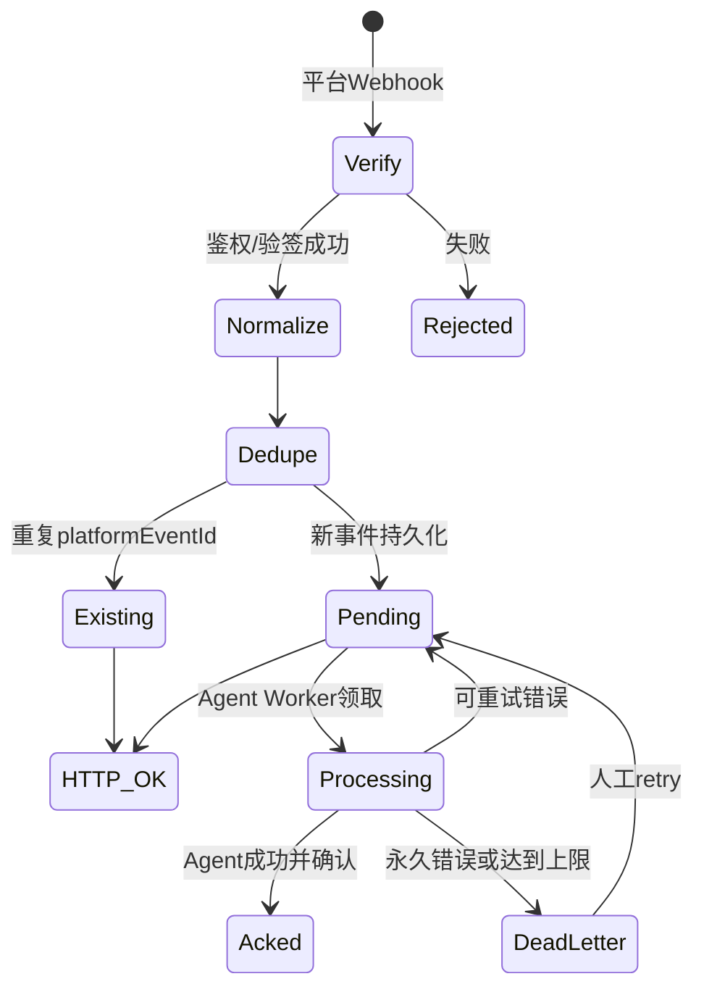
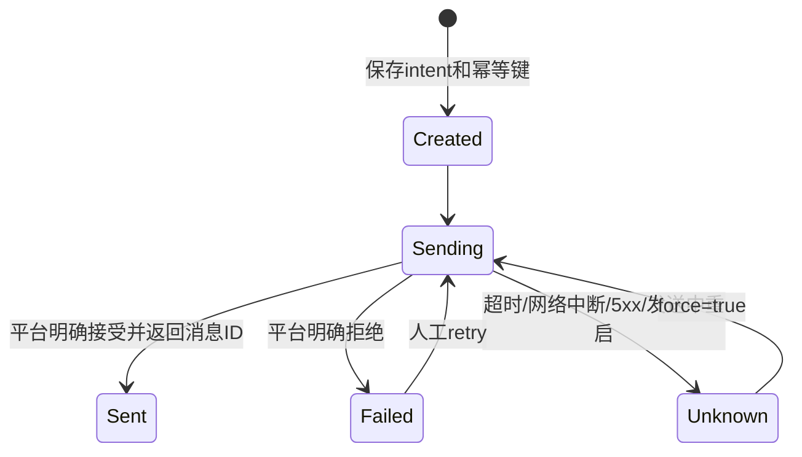

# 架构与实现说明

## 1. 设计目标

该服务只承担“聊天平台与 Agent 运行时之间的消息边界”，不承担推理、工具调用和业务编排。主要设计目标：

1. 平台协议与 Agent 协议解耦；
2. 入站事件先持久化再确认；
3. 平台重复投递不重复触发 Agent；
4. 同一会话保持顺序，不同会话允许并发；
5. 出站结果具有可审计的意图和回执；
6. 对不确定发送结果采取 fail-closed 策略；
7. 核心不依赖任一 Agent 框架。

## 2. 模块结构

```text
src/
├── index.js                    # CLI、生命周期、信号处理
├── config.js                   # JSON配置、环境变量、校验、脱敏
├── app.js                      # 依赖装配
├── server.js                   # REST、Webhook、SSE路由
├── logger.js                   # JSON日志
├── adapters/
│   ├── loopback.js             # 本地测试通道
│   ├── generic-webhook.js      # 通用HMAC入站和HTTP出站
│   ├── feishu.js               # 飞书/Lark
│   └── common.js               # 通用请求标准化
├── core/
│   ├── registry.js             # Adapter注册、别名和能力发现
│   ├── gateway.js              # 入站/出站核心服务
│   ├── store.js                # 单实例JSON持久化状态
│   ├── delivery-worker.js      # Agent回调、重试和死信
│   ├── sse-hub.js              # 实时事件广播
│   ├── validation.js           # 统一协议校验
│   ├── ids.js                  # ID、会话键和去重键
│   └── errors.js               # 结构化错误
└── util/
    ├── crypto.js               # HMAC、恒定时间比较、飞书签名和解密
    └── http.js                 # 有界请求体和上游HTTP调用
```

## 3. 入站生命周期



`POST /webhooks/*` 在事件写入 `gateway-state.json` 后才返回成功。进程重启时，原处于 `processing` 的事件被恢复为 `pending`。

## 4. 会话与并发

会话键：

```text
sha256(channel, accountId, conversationId, threadId)
```

`DeliveryWorker` 使用 `activeSessions`：

- 相同 `session.key` 在任意时刻最多有一个回调在执行；
- 不同 `session.key` 可并发处理；
- 总并发受 `delivery.concurrency` 限制；
- 队列按全局 `sequence` 优先选择最早的可执行事件。

这保证了同一聊天线程内的基本顺序，又避免一个慢会话阻塞全部平台会话。

## 5. 去重语义

去重键：

```text
channel + accountId + platformEventId
```

去重记录具有保留期限 `storage.dedupeRetentionMs`。没有 `platformEventId` 的可信入站事件无法进行平台级去重，因此生产桥接器必须提供稳定事件 ID。

## 6. Agent 消费方式

### 6.1 回调模式

网关主动把事件 POST 到 Agent；适合部署简单、要求自动重试的场景。

### 6.2 轮询模式

Agent 周期调用 `/v1/events`，处理后调用 `/ack`。适合已有队列消费者或不希望 Gateway 主动访问 Agent 的网络边界。

### 6.3 SSE 模式

Agent 保持 `/v1/events/stream` 连接获取实时事件，并在处理后 ACK。重连时使用 `after_sequence` 或 `Last-Event-ID` 回放。

SSE 是通知机制，不替代持久化队列。消费者应始终以事件 ID 和 ACK 状态作为处理依据。

## 7. 出站生命周期



### 为什么需要 `unknown`

HTTP 请求可能已经到达聊天平台，但响应丢失。此时自动重试可能发送两次。服务选择：

- 不把超时简单当作 `failed`；
- 将其标记为 `unknown`；
- 默认拒绝同幂等键重放；
- 由运维人员核对平台后决定是否强制重试。

Generic 平台桥接器应进一步使用 `delivery_id` 实现平台侧幂等，从而缩小不确定窗口。

## 8. 持久化实现

当前 `JsonStateStore`：

- 单进程内通过 Promise 链串行修改状态；
- 写入临时文件后 `rename` 替换正式文件；该机制支持普通进程崩溃/重启恢复，但当前版本未对文件和目录执行 `fsync`，不宣称断电级持久性；
- 文件权限为 `0600`，目录尝试使用 `0700`；
- 重启恢复未完成入站处理；
- 重启时将 `sending` 出站意图改为 `unknown`；
- 按保留期限清理已确认事件和去重索引。

局限：

- 没有跨进程锁；
- 不支持多副本同时写同一文件；
- `rename` 原子性依赖同一文件系统；
- 数据量大时每次全量 JSON 写入成本上升。

生产多副本应把 `JsonStateStore` 替换为 PostgreSQL、SQLite 单主、Redis Streams 或消息队列，并保持现有 Store 方法语义。

## 9. 扩展点

核心扩展点是 Adapter：

```javascript
{
  id,
  meta,
  capabilities,
  async receive(context) -> { events, response?, ignored? },
  async send(context) -> { platformMessageId, conversationId, raw }
}
```

核心不读取平台专有字段；平台适配器负责：

- 鉴权和签名；
- 平台事件解析；
- 统一事件标准化；
- 平台 token 生命周期；
- 出站 API 与平台错误分类。

## 10. 主要不变量

- 成功的 Webhook 响应不早于状态持久化；
- `sequence` 在单实例中单调递增；
- 同一 `platformEventId` 在去重窗口内映射到同一内部事件；
- 同一幂等键只能绑定一个规范化出站请求；
- `sent` 意图必须指向一个回执；
- `unknown` 不会被普通重试自动重放；
- 同一会话不会由回调 Worker 并行处理。
